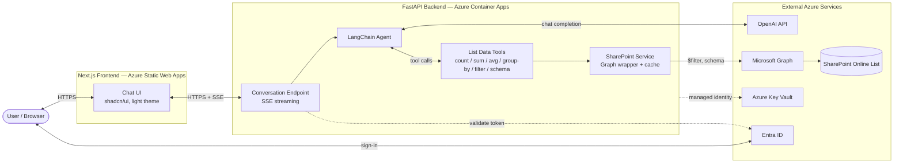
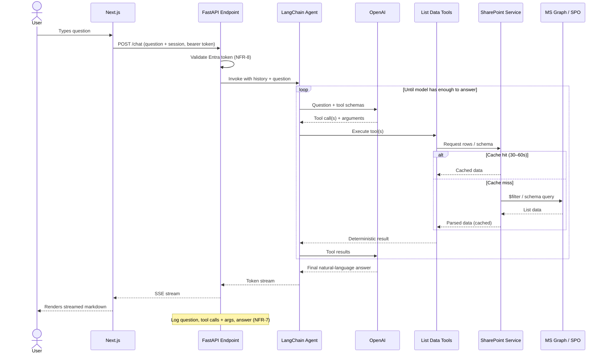
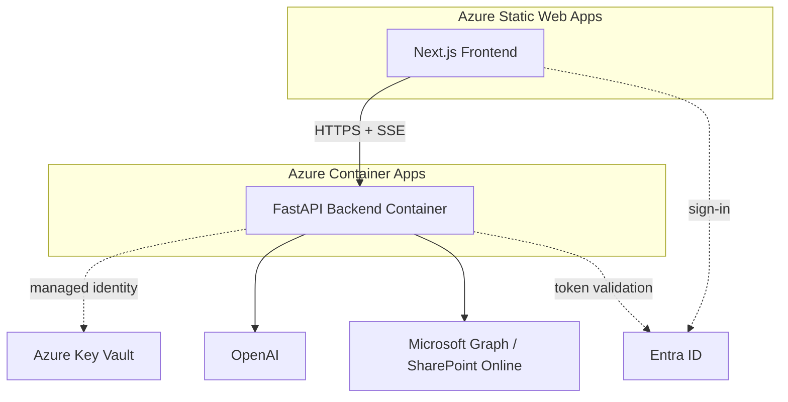

# Architecture — SharePoint List AI Assistant

| | |
|---|---|
| **Version** | 0.1 (Draft) |
| **Date** | 4 June 2026 |
| **Author** | Fiqri |
| **Status** | For review |
| **Companion document** | [PRD — SharePoint List AI Assistant](./PRD-SharePoint-List-AI-Assistant.md) |

---

## 1. Purpose and Scope

This document describes the technical architecture for the SharePoint List AI Assistant: a web application that answers plain-English questions about a SharePoint list. It elaborates the architecture summarised in §6 of the PRD into component responsibilities, request flows, data handling, security boundaries, and deployment topology.

It is the engineering reference for building Phases 1–5 (PRD §10). Where the PRD states *what* and *why*, this document states *how*. Functional requirements (FR-n) and non-functional requirements (NFR-n) referenced below are defined in the PRD.

### Architectural goals

- **Accuracy by construction** — the LLM never computes; all arithmetic is deterministic Python (FR-7, FR-9, NFR-5).
- **Secrets stay server-side** — the browser holds no credentials and makes no direct Graph/LLM calls (NFR-1, NFR-2).
- **List-agnostic** — list structure is discovered at runtime; site/list IDs are configuration, not code (FR-13, D-4).
- **Responsive** — streamed answers and short-lived caching keep typical responses under ~5 s (FR-4, NFR-3).

---

## 2. Architectural Overview

The system is a three-tier application: a stateless **Next.js frontend**, a **FastAPI backend** that owns all orchestration and secrets, and **external Azure services** (OpenAI, Microsoft Graph / SharePoint Online, Entra ID, Key Vault).

The single most important architectural line is the **trust boundary** between the frontend and backend. Everything sensitive — the LangChain agent, OpenAI access, Graph access, secrets — lives behind it.

The dashed frontend↔backend edge is the trust boundary (PRD §6.4, §7.1).

---

## 3. Component Architecture

The components map directly to the layers in PRD §6.2.

### 3.1 Frontend — Next.js chat client

**Responsibility:** render the conversation, capture input, display streamed answers. A pure client of the backend.

- App Router with shadcn/ui components, light theme (FR-1, global UI convention).
- Single centred text input as the primary control — no filter panels or form fields (FR-1).
- Conversation rendered as a vertical thread; assistant answers render markdown (FR-2, FR-3).
- Consumes an SSE stream and appends tokens as they arrive; shows a typing indicator while generating (FR-4).
- Retains conversation history in client/session state for the browser session (FR-5) and offers a "new conversation" control (FR-6).
- **Holds no secrets** and makes **no direct Graph or LLM calls** (NFR-1, NFR-2). Its only backend is the FastAPI conversation endpoint.

> **Vertical-slice note:** organise the frontend by feature slice (e.g. `features/chat/`) — component, hooks, API client, and types co-located — rather than by technical layer.

### 3.2 Backend — FastAPI conversation endpoint

**Responsibility:** the trust-boundary entry point. Authenticates the request, holds per-session chat history, invokes the agent, and streams tokens back.

- Validates the Entra ID token on **every** request; rejects unauthenticated calls (NFR-8, D-2).
- Maintains chat history keyed by session so follow-ups have context (FR-5).
- Invokes the LangChain agent and relays the model's output as an SSE token stream (FR-4).
- Emits observability logs: the question, each tool call with arguments, and the final answer (NFR-7).

### 3.3 LangChain agent + OpenAI

**Responsibility:** understand the question, decide which tools to call, and phrase the final answer — nothing else.

- Agent with tool calling via `langchain-openai`'s `ChatOpenAI` against OpenAI's API (PRD §6.1).
- The model selects tools and arguments; it does **not** compute facts or figures (FR-7, §6.3).
- Handles ambiguity by asking a clarifying question, and declines unrelated questions politely (FR-10, FR-11).
- Tool names, descriptions, and argument schemas are written carefully — the model's correctness depends on them (§6.3, NFR-6).

### 3.4 List Data tools

**Responsibility:** the boundary where LLM intent becomes deterministic code. Every fact in an answer originates here.

Minimum tool set (FR-8):

| Tool | Purpose |
|---|---|
| `get_schema` | Return list column names and types so the model knows what it can query (FR-14). |
| `filter_rows` | Retrieve filtered rows; pushes `$filter` to Graph for large lists (§8). |
| `count_rows` | Count rows matching a condition. |
| `sum_column` | Sum a numeric column. |
| `average_column` | Average a numeric column. |
| `group_and_aggregate` | Group by a column and aggregate. |

All numeric computation runs in Python over retrieved data (FR-9, NFR-5). Tools parse loosely-typed SharePoint values defensively and skip rows that cannot be parsed for a given operation (§8, column typing).

### 3.5 SharePoint service

**Responsibility:** wrap Microsoft Graph access, authentication, and caching.

- Reads list items and schema through Microsoft Graph (`msgraph-sdk`), authenticated via `azure-identity` / `msal` using the **client-credentials** flow — the app reads on its own behalf (PRD §6.4, D-1).
- Site URL and list ID are configuration values (FR-13, D-4); structure is discovered at runtime via schema (D-4).
- **Short-lived cache** (30–60 s TTL, configurable) so a single multi-step answer does not re-fetch repeatedly (FR-15, NFR-4, D-3).
- Pushes filtering to Graph (`$filter`) and applies a row-count threshold to trigger filtered-only behaviour, keeping large lists within the context window (§8).

### 3.6 External services

OpenAI, Microsoft Graph + SharePoint Online (the source list), Entra ID (identity), and Azure Key Vault (secrets at runtime).

---

## 4. Request Flow

The end-to-end flow for a single question (PRD §6.2). The agent ↔ tools loop may iterate several times before the model composes its answer.

---

## 5. Data Architecture

### 5.1 Data flow and typing

SharePoint returns field values loosely typed (§8). The SharePoint service and List Data tools are jointly responsible for safe parsing:

- **Numbers / dates / choice fields** are parsed defensively; rows whose value cannot be parsed for the requested operation are **ignored**, not guessed (§8, NFR-6).
- **Internal vs display field names** can differ; `get_schema` exposes names the model can reliably reference (§8).
- No list data leaves the backend except as rendered answer text (NFR-2).

### 5.2 Large lists

Fetching every row eventually overflows the LLM context window and slows responses (§8). Mitigations:

- `filter_rows` pushes `$filter` to Graph so only relevant rows load.
- A configurable **row-count threshold** triggers filtered-only behaviour (D-4 "Filtered-retrieval row threshold", TBC).

### 5.3 Caching

A short-lived cache (30–60 s TTL, configurable — D-3) sits in the SharePoint service. It exists to avoid redundant Graph calls **within a single multi-step answer** (NFR-4), while keeping data near-real-time. TTL is configuration, tunable without a code change.

### 5.4 State

- **Conversation history** — per browser session, held client-side (FR-5) and in the backend endpoint for the agent's context.
- **No persistent data store** in v1 — the SharePoint list is the single source of truth. Write-back is out of scope (PRD §9).

---

## 6. Security Architecture

### 6.1 Trust boundary

The **Next.js ↔ FastAPI boundary is the trust boundary** (PRD §6.4). The frontend is untrusted with respect to secrets; the backend owns all credentials, Graph calls, and LLM access.

### 6.2 Two distinct identities

A deliberate separation (PRD §6.4, D-1, D-2):

| Identity | Purpose | Mechanism |
|---|---|---|
| **End-user identity** | Governs *access to the app* | Entra ID sign-in; backend validates token on every request (NFR-8) |
| **App's read identity** | Governs *how the app reads SharePoint* | Client-credentials flow via `azure-identity` / `msal` — a single shared read account in v1 (D-1) |

In v1 all authenticated users share the single read identity. **Constraint (D-1):** the users allowed to sign in should match the SharePoint members group. Per-user delegated/on-behalf-of auth is a later-phase option if item-level security is ever introduced (PRD Open Question lineage).

### 6.3 Graph permissions

- App registration granted `Sites.Read.All`, or preferably the scoped `Sites.Selected` granted to the one site, with admin consent (PRD §6.4).
- Least privilege: prefer `Sites.Selected` to avoid over-broad access (PRD §11 risk).

### 6.4 Secrets management

- All secrets (OpenAI keys, Entra client secret, connection settings) live in **Azure Key Vault** and are retrieved at runtime by the backend (NFR-1, D-5).
- The container's **managed identity** is granted read access to the vault.
- Local development may use environment variables / `.env` standing in for the vault — **no secret is ever committed** (NFR-1).

---

## 7. Deployment Architecture

Per PRD §6.1 and D-5.

| Concern | Approach |
|---|---|
| **Frontend hosting** | Azure Static Web Apps. Holds no secrets; pure backend client (§6.1). |
| **Backend hosting** | Containerised FastAPI on Azure Container Apps (container-based app) (§6.1, D-5). |
| **Secrets** | Azure Key Vault, read via the container's managed identity (NFR-1, D-5). |
| **Config** | Site URL, list ID, cache TTL, row threshold as configuration, not code (FR-13, D-3, D-4). |
| **Streaming** | SSE from backend through to the browser (FR-4). |

---

## 8. Observability

Per NFR-7, the backend logs for every request:

- The user's question.
- Each tool the model chose to call, **with its arguments**.
- The final answer.

This supports debugging and trust verification — confirming that figures came from tool execution, not the model. Token usage should be monitored to manage OpenAI cost (PRD §11 risk).

---

## 9. Mapping to Implementation Phases

The architecture is buildable incrementally along PRD §10's phases.

| Phase | Components delivered |
|---|---|
| **1 — Foundation** | SharePoint service (§3.5), Entra app registration, Graph access. Verified by script/test harness. |
| **2 — Agent core** | LangChain agent (§3.3) + List Data tools (§3.4) in FastAPI (§3.2). Tool calling end-to-end. |
| **3 — Chat UI** | Next.js client (§3.1): input, thread, markdown, loading, SSE, new-conversation. |
| **4 — Hardening** | Caching (§5.3), large-list filtered retrieval (§5.2), logging (§8), clarification (§3.3), accuracy tests. |
| **5 — Deploy** | Key Vault secrets, Static Web Apps frontend, Container Apps backend (§7). Smoke testing. |

---

## 10. Architectural Risks

Drawn from PRD §11, framed architecturally.

| Risk | Architectural mitigation |
|---|---|
| LLM does arithmetic and gets it wrong | Computation confined to List Data tools (§3.4); model only phrases results. Accuracy test suite (NFR-5). |
| Large list overflows context | `$filter` pushdown + row-count threshold in the SharePoint service (§5.2). |
| Model calls wrong tool / misreads a column | Carefully written tool schemas (§3.4); `get_schema`; clarification behaviour (§3.3). |
| Graph permissions over-broad | Prefer `Sites.Selected` scoped to one site (§6.3). |
| OpenAI cost | Caching (§5.3), concise prompts, token monitoring (§8). |

---

## 11. Open Items

Inherited from the PRD; resolve before or during the relevant phase.

- **Target list details (D-4)** — Site URL, list name, list ID, key columns, approximate row count, and the filtered-retrieval row threshold remain *TBC*. The design stays list-agnostic, so these are configuration values, not code changes.
- **Per-user SharePoint identity** — deferred to a later phase; would shift the app's read identity from client-credentials to delegated/on-behalf-of (§6.2, D-1).
